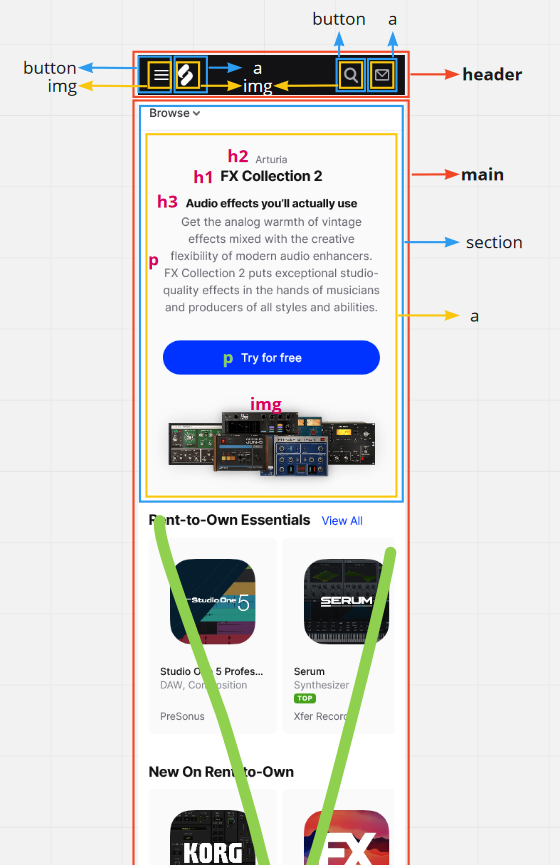
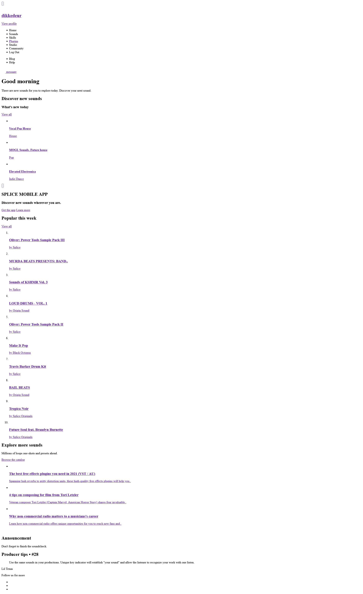

# Procesverslag
Markdown is een simpele manier om HTML te schrijven.  
Markdown cheat cheet: [Hulp bij het schrijven van Markdown](https://github.com/adam-p/markdown-here/wiki/Markdown-Cheatsheet).

Nb. De standaardstructuur en de spartaanse opmaak van de README.md zijn helemaal prima. Het gaat om de inhoud van je procesverslag. Besteedt de tijd voor pracht en praal aan je website.

Nb. Door *open* toe te voegen aan een *details* element kun je deze standaard open zetten. Fijn om dat steeds voor de relevante stuk(ken) te doen.

## Jij

uitwerken voor kick-off werkgroep

### Auteur:
Rick van Dijken

#### Je startniveau:
rode piste

#### Je focus:
responsive
 

## Je website

uitwerken voor kick-off werkgroep

### Je opdracht:
ik ga https://splice.com namaken.

#### Screenshot(s) van de eerste pagina (small screen): 
homepage splice  

#### Screenshot(s) van de tweede pagina (small screen):
inlogscherm splice  

 

## Breakdownschets (week 1)

uitwerken na afloop 2e werkgroep

### de eerste pagina: 

### de tweede pagina: 

### navigatie: 

### dropdown: 

### form: 

## Voortgang 1 (week 2)

HTML bijna af, CSS nog niet aan begonnen.

### Stand van zaken
De breakdown schets kostte veel tijd, maar uiteindelijk scheelde het waarschrijnlijk
veel tijd bij het schrijven van de HTML. 

Ik heb tot nu toe alleen de HTML geschreven, maar veel afbeeldingen ontbreken nog. 
Ik ben nog nergens tegenaan gelopen, omdat ik nog niet aan het CSS bestand ben begonnen.

#### Screenshots HTML

Ik probeer na het inleveren van dit document om 18:00 (19-09-21) nog aan de CSS te beginnen.
Dus wellicht heb ik morgen ook al wat gestijld.

### Agenda voor meeting
samen met je groepje opstellen

| Rick           | student 2          | student 3    | student 4        |
| ---            | ---                | ---          | ---              |
| Ik heb zelf    | en dit             | en ik dit    | en dan ik dat    |
| niets te       | dit als er tijd is | nog een punt | dit wil ik zeker |
| bespreken, dus | ...                | ...          | ...              |
| ik luister mee.|

### Verslag van meeting
- Ik heb veel vragen gesteld over de structuur van mijn HTML. Die klopt nu na de feedback bijna volledig. 
  Er missen alleen nog een paar afbeeldingen.

## Voortgang 2 (week 3)

De HTML is helemaal af en ik ben begonnen met stijlen. Ik heb de header en de hero nu gestijld,
maar loop vast bij een scrollbare ul die niet "snapt"  en twee elementen die ik naast elkaar moet plaatsen.

### Stand van zaken
Hun website:

Mijn versie:

### Agenda voor meeting
samen met je groepje opstellen

| Rick           | Esther             | student 3    | student 4        |
| ---            | ---                | ---          | ---              |
| Een a naast een| header animatie    | en ik dit    | en dan ik dat    |
| h3 plaatsen    | ...                | nog een punt | dit wil ik zeker |
|zonder container| ...                | ...          | ...              |
| &              |
|order veranderen|
| van li's items |
| &              |
| scrollbare ul  | 
| snapt niet.    |

### Verslag van meeting
- Ik was de enige aanwezig bij het voortgangsgesprek. Hierdoor ben ik met alles in het bovenstaande lijstje geholpen.
  Het naast elkaar plaatsen van elementen, de order van li's veranderen en een de ul laten scrollen.

## Toegankelijkheidstest (week 4)

uitwerken na test in 8e voortgang

### Bevindingen

#### Bevindingen voor gebruik met toetsenbord
- Zonder het hamburger-menu te hebben uitgeklapt doorloop je met tab alle links die daar in staan. Dit zou niet moeten als hij is ingeklapt.

Ik weet nog niet hoe ik dit fix.

#### Bevindingen na testen met slecht zicht en parkinson
- Optie om font size groter te maken. Dit maakt het in het algemeen voor slechtzienden makkelijker om de website te gebruiken.

- Grijze teksten donkerder maken voor een beter contrast.

- Je zou besturing door middel van spraak kunnen toepassen bij parkinson.

Ik weet hoe ik dit kan doen (behalve de spraakbesturing voor parkinson), maar ik ga mijn website responsive maken dus ik laat dit even links liggen.

#### Bevindingen na het gebruik van een narrator
- Narrator leest koppen en tekst niet goed voor (maar dit kwam omdat ik de besturing niet goed had doorgelopen).
- Bij de app advertentie op de home-page zei de narrator niet wat de button zou doen, namelijk het sluiten van de advertentie.

Door middel van een aria-label leest de narrator de close-button nu goed voor.

## Voortgang 3 (week 4)

uitwerken voor 3e voortgang

### Stand van zaken
De eerste pagina is helemaal gereed voor telefoon. Nu moet ik het responsive gaan maken, maar ik weet niet zo goed waar ik moet starten.

### Agenda voor meeting
samen met je groepje opstellen

| Rick           | student 2          | student 3    | student 4        |
| ---            | ---                | ---          | ---              |
| Waar begin ik  | en dit             | en ik dit    | en dan ik dat    |
| met het respon-| dit als er tijd is | nog een punt | dit wil ik zeker |
| sive maken     | ...                | ...          | ...              |

### Verslag van meeting
hier na afloop snel de uitkomsten van de meeting vastleggen

- Mijn geheugen is even verfrist. Ik moet gewoon "@media only screen and (min-width: "breedte van het breakpoint") {}" gebruiken.

## Eindgesprek (week 5)

uitwerken voor eindgesprek

### Stand van zaken
De website responsive maken ging deels goed. Ik zeg deels omdat ik maar één van de twee pagina's af heb gekregen en omdat ik niet snapte hoe ik mijn hamburgermenu bij groot beeld in een rij in mijn header kon zetten.

Ik ben wel trots op een ol die ik op klein scherm in één lange lijst van 10 heb en op groot scherm twee lijstjes van 5. En ook over de responiveness van de cards bij de sectie tips & tutials ben ik trots.

De lijst:

Ik ben minder trots op de tweede pagina: de plugin-pagina. Door een slechte planning, gebrek aan motivatie en het onderschatten van de hoeveelheid werk dat het is, heb ik het niet afgekregen.

### Screenshot(s)

hier screenshot(s) van je eindresultaat

## Bronnenlijst

continu bijhouden terwijl je werkt

Nb. Wees specifiek ('css-tricks' als bron is bijv. niet specifiek genoeg).

1. How to Hide the Scrollbar in CSS by Jamie Juviler. Scrollbar verbergen maar wel functionaliteit behouden: https://blog.hubspot.com/website/hide-scrollbar-css
2.  Gridbyexample. Hier kan je bekijken hoe bepaalde voorbeeld-grids in elkaar zitten qua code: https://gridbyexample.com/examples/example5/
3. css-tricks.com A Guide To Flexbox: https://css-tricks.com/snippets/css/a-guide-to-flexbox/
4. DLO opdrachten.

